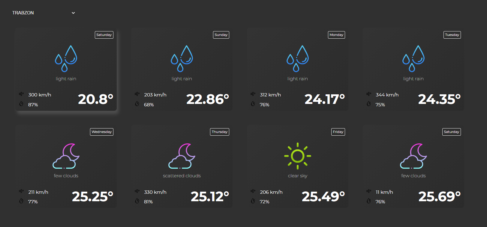

# React + Context Weather App

<p align="center">
  
<p>

## Gereksinimler

- Uygulama, Context API kullanılarak geliştirilmelidir.

- Hava raporunda görüntülenen veriler tamamen gerçeği yansıtmalıdır. Hava durum bilgilerine erişmek için OpenWeather API kullanılabilir. Veya dilediğiniz farklı bir API'ı da kullanabilirsiniz.


- Hava raporu, içinde bulunduğumuz günden başlayarak önümüzdeki bir haftalık süreci yansıtacaktır. Yukarıdaki görseli referans alabilirsiniz.


- Sayfa ilk açıldığında varsayılan olarak dilediğiniz herhangi şehrin hava durumunu gösterebilirsiniz. Bu noktada yapmak isteyenler için kullanıcıdan konum erişim izni istenerek bulunduğu şehrin bilgileri varsayılan olarak gösterilebilir.


- Yine yukarıdaki görselde görüleceği üzere, içinde bulunduğumuz gün, bir background ve border ile belirginleştirilmelidir.


- Günlerin listelendiği kartlarda; gün adı, hava durumu görseli(güneşli, yağmurlu, karlı, parçalı bulutlu), en yüksek ve en düşük sıcaklık gösterilmelidir.


- Bir dropdown aracılığı ile farklı bir şehrin hava raporuna ulaşılabilmelidir.

  
## API Kullanımı

https://openweathermap.org/

  
## Bilgisayarınızda Çalıştırın

Projeyi klonlayın

```bash
  git clone https://link-to-project
```

Proje dizinine gidin

```bash
  cd my-project
```

Gerekli paketleri yükleyin

```bash
  npm install
```

Sunucuyu çalıştırın

```bash
  npm run start
```

  
## Çıkarılan Dersler

Bu projede Context ve svg kullanımını etkili bir şelilde öğrendim.
